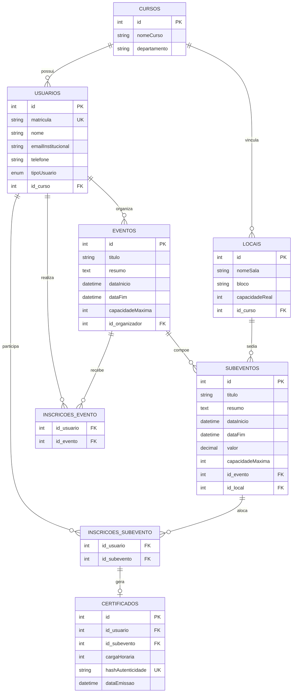
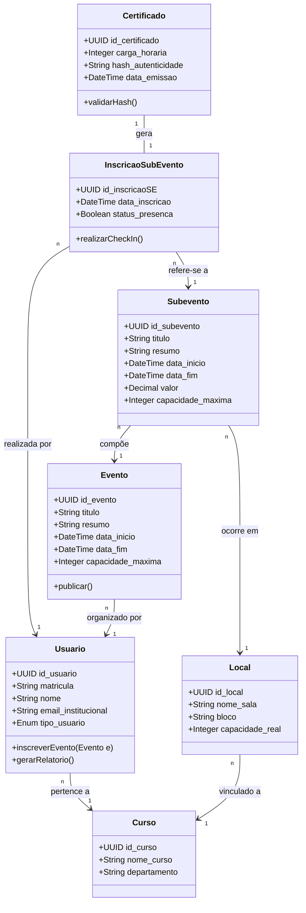

# IFS Eventos - Gestor de Eventos Acadêmicos

  
  
  

## 👥 Autores
* **Luiz Eduardo da Silva Albuquerque**
* **Lorena Vieira Ribeiro**

---

## 📌 Sobre o Projeto
O **IFS Eventos** é uma plataforma centralizada para a gestão, divulgação e participação em eventos acadêmicos do Instituto Federal de Sergipe (IFS). O sistema visa otimizar todo o ecossistema de extensão e pesquisa, desde a criação do evento por docentes até o controle de presença automatizado e a emissão de certificados autenticáveis para discentes.

---

## 🎭 Análise de Ecossistema (Atores & Stakeholders)

### Atores (Usuários Diretos)
* **Discentes:** Alunos que buscam eventos, realizam inscrições e gerenciam suas participações.
* **Docentes/Organizadores:** Professores ou técnicos que criam, gerenciam e monitoram os eventos.
* **Administrador do Sistema:** Equipe de TI do IFS responsável pela manutenção e suporte do software.

### Stakeholders (Interessados Indiretos)
* **Direção do IFS:** Monitoramento de relatórios de atividades de extensão e engajamento acadêmico.
* **Departamento de TI (DTI):** Governança da infraestrutura de dados e segurança da informação.
* **Setor de Extensão/Pesquisa:** Validação de certificados emitidos e consolidação de métricas institucionais.

---

## 🗄️ Arquitetura de Banco de Dados (Modelo Relacional)

O banco de dados é estruturado em tabelas normalizadas com forte integridade referencial. Abaixo encontram-se as especificações das entidades do sistema:

### 1. `Usuarios` (Sincronizado institucionalmente)
* `id_usuario` (PK): `UUID` ou `Integer`
* `matricula` (Unique): `String`
* `nome`: `String`
* `email_institucional`: `String`
* `telefone`: `String`
* `tipo_usuario`: `Enum ('Discente', 'Docente', 'Admin')`
* `id_curso` / `id_departamento` (FK): Referencia `Cursos`

### 2. `Locais`
* `id_local` (PK): `UUID` ou `Integer`
* `nome_sala`: `String`
* `bloco`: `String`
* `capacidade_real`: `Integer`
* `id_curso` / `id_departamento` (FK): Referencia `Cursos`

### 3. `Eventos`
* `id_evento` (PK): `UUID` ou `Integer`
* `titulo`: `String`
* `resumo`: `Text`
* `data_inicio`: `Datetime`
* `data_fim`: `Datetime`
* `capacidade_maxima`: `Integer`
* `id_organizador` (FK): Referencia `Usuarios`

### 4. `Subeventos`
* `id_subevento` (PK): `UUID` ou `Integer`
* `titulo`: `String`
* `resumo`: `Text`
* `data_inicio`: `Datetime`
* `data_fim`: `Datetime`
* `local`: `String`
* `valor`: `Decimal (10,2)` (0.00 se gratuito)
* `capacidade_maxima`: `Integer`
* `id_evento` (FK): Referencia `Eventos`

### 5. `InscricoesEvento` (Relação N:M)
* `id_inscricaoE` (PK): `UUID`
* `id_usuario` (FK): Referencia `Usuarios`
* `id_evento` (FK): Referencia `Eventos`
* `data_inscricao`: `Timestamp` (Default: `NOW`)

### 6. `InscricoesSubEvento` (Relação N:M)
* `id_inscricaoSE` (PK): `UUID`
* `id_usuario` (FK): Referencia `Usuarios`
* `id_subevento` (FK): Referencia `Subeventos`
* `data_inscricao`: `Timestamp` (Default: `NOW`)
* `status_presenca`: `Boolean` (Default: `FALSE`)

### 7. `Certificados` (Pós-Evento)
* `id_participacao` (PK): `UUID`
* `id_inscricaoSE` (FK): Referencia `InscricoesSubEvento`
* `carga_horaria`: `Integer`
* `hash_autenticidade` (Unique): `String`
* `data_emissao`: `Timestamp` (Default: `NOW`)

---

## 📊 Modelagem Conceitual & Regras de Mapeamento (DER)

1. **Núcleo Acadêmico:** Múltiplos `Usuarios` e `Locais` pertencem a uma estrutura centralizada de `Cursos/Departamentos`. Um Docente pode gerenciar `N` `Eventos`.
2. **Composição Exclusiva:** Um `Evento` macro possui uma relação de agregação/composição forte de `1:N` para `Subeventos`. Cada `Subevento` está associado a um `Local` físico regulando a lotação.
3. **Muitos-para-Muitos (N:M):** As tabelas `InscricoesEvento` e `InscricoesSubEvento` resolvem as associações de usuários com as agendas desejadas.
4. **Certificação:** Uma `InscricaoSubEvento` confirmada com `status_presenca = TRUE` dispara a emissão de `1` `Certificado` contendo um `hash_autenticidade` para verificação externa.

## 📊 Diagrama de Entidade-Relacionamento (DER)

---

## 📐 Diagrama de Classes UML (Mermaid)

O diagrama abaixo descreve a estrutura de classes do domínio e suas respectivas relações.

